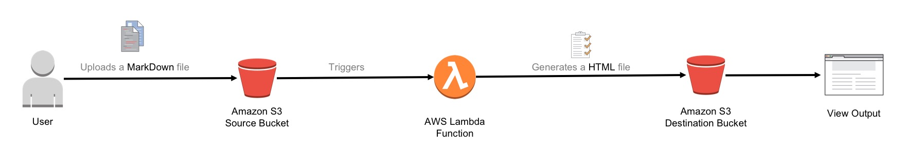
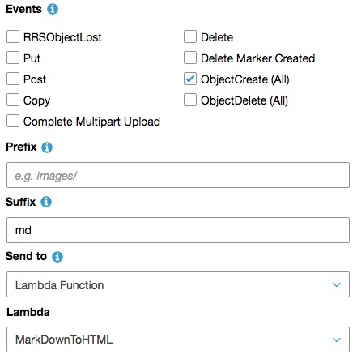

# AWS Lambda MarkDown to HTML Converter



1. Create a folder called **MarkDownToHTML** and continue to perform all the below operations in the same folder.

2. Update the `src/index.js` file with appropriate values and then copy the file to the MarkDownToHTML directory.

   **NOTE:** Make sure to replace values marked as comments.

```js
exports.handler = (event, context, callback) => {

    const AWS = require('aws-sdk');
    const marked = require('marked');

    // UPDATE BELOW VALUES
    const regon = 'ap-southeast-2' // Change the region of the Amaszon S3 bucket.
    const out_bucket = 'sereyo.com' //Update the name of the output bucket.

    marked.setOptions({
        renderer: new marked.Renderer(),
        gfm: true,
        tables: true,
        breaks: false,
        pedantic: false,
        sanitize: false,
        smartLists: true,
        smartypants: false
      });

    AWS.config.update({
        region: regon
    });

    var s3 = new AWS.S3();


    event.Records.forEach((r) => {

        var bucketname = r.s3.bucket.name;
        var key = r.s3.object.key;

        let s3getObject = s3.getObject({
            Bucket: bucketname,
            Key: key
        }).promise();

        s3getObject.then((data) => {

          return marked(String(data.Body));

        }).then((formatted) => {

            let newFileName = key.split(".")[0] + ".html"
            console.log(`Uploading file ${newFileName} to the bucket mnhtmloutput`);


            // Generate the HTML Header, Style & Body
            // A Sample CSS file has been provided to render the output. Make sure to update the below CSS URL with one of your own liking.

            var head = `<html>
                   <head>
                   <meta charset="utf-8">
                   <meta name="viewport" content="width=device-width, initial-scale=1, minimal-ui">
                   <title>Markdown</title>
                    <link rel="stylesheet" type="text/css" href="https://s3-ap-southeast-2.amazonaws.com/aws-trng-syd/DO-NOT-DELETE-assets/default.css" charset="utf-8"/>
                   </head> 
                 <body>
                   <article class="markdown-body">`;

            // Close out the HTML Body
            
            var tail = `</article>
                </body> 
                </html>`;

            // Append the Head, Body and Tail of the final document

            html = head + formatted + tail;

            s3.putObject({
                Bucket: out_bucket, //Update the output bucket name here.
                Key: newFileName,
                Body: html,
                ContentType: 'text/html'
    
            }, (err,data)=>{

                if(err){
                    console.log(err.message);
                }

                else{

                    console.log(data.ETag);
                    console.log("Object uploaded to the output bucket")
                }
            })
        }).catch((err) => {

            console.log(err.message);
        })

    });
}
```

3. On the **Terminal** find your way to the directory.

    **E.G :** ` cd MarkDownToHTML`

4. Run the following command `npm init` and provide the relevant information. The resulting `package.json` file should look like the below output.

```json
{
  "name": "markdowntohtml",
  "version": "1.0.0",
  "description": "This application converts a MarkDown file to HTML.",
  "main": "index.js",
  "scripts": {
    "test": "echo \"Error: no test specified\" && exit 1"
  },
  "keywords": [
    "MarkDown",
    "MD",
    "HTML"
  ],
  "author": "Manoj Nair, Karthik Chandy and Benjamin Newton",
  "license": "LICENSED",
  "dependencies": {
    "marked": "^0.3.12"
  }
}
```

5. While in the same directory, run the following command. This will install [marked](https://www.npmjs.com/package/marked) that is a full-featured markdown parser and compiler, written in JavaScript.This step should create a `package-lock.json` file.

    `npm install marked`

6. Create a .zip file by selecting all the files and directory. 

7. Create a Node.js 6 based AWS Lambda Function and make sure the function name matches the name of the .zip file created in the last step. More information can be found [here](https://docs.aws.amazon.com/lambda/latest/dg/get-started-create-function.html). 

8. Create a source Amazon S3 bucket. Steps [here](https://docs.aws.amazon.com/AmazonS3/latest/gsg/CreatingABucket.html).

9. Create an Amazon S3 event notification to notify the previously created AWS Lambda function, only when a file with a .md extension is created in the source Amazon S3 bucket. s3-event.JPG
    - **Events** - ObjectCreate(All)
    - **Suffix** - md
    - **Send to** - Lambda Function
    - **Lambda** - Select the name of the Lambda Function.

  

10. All set. Now upload a Mark Down file to the source bucket and see the HTML output in the destination bucket.
    
    **NOTE:** The output of the resulting HTML file will depend on the CSS file that was used. 
